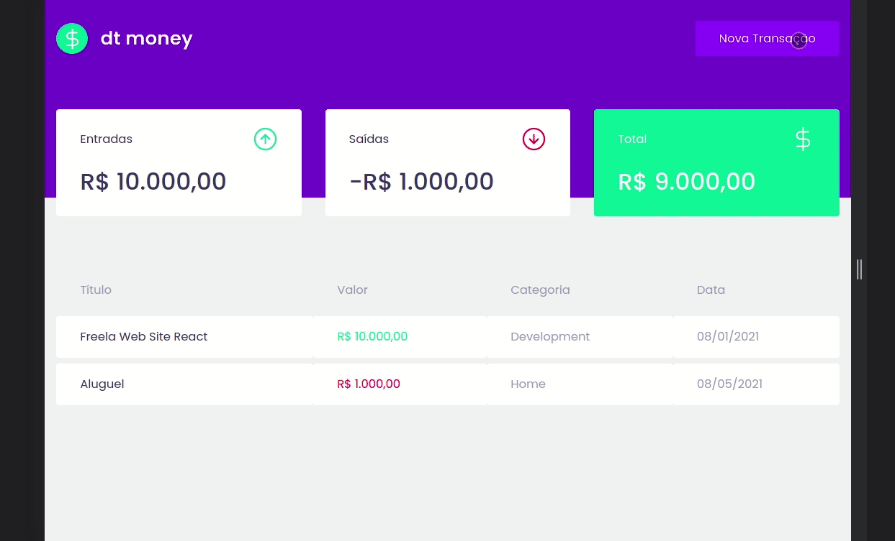

# igniteDtMoneyReactJS

<div>
  
</div>

</br>



<h3 align="center">
  App with ReactJS, MirageJs and Styled-Components.
</h3> 

</br>

## :open_file_folder: About

The App was developer to register **transactions** and list them. Was used **MirageJs** to simulate an api and **useContext** to share the props on the best way.

</br>

## :rocket: Technologies

- [ReactJs](https://reactjs.org)
- [Axios](https://axios-http.com/)
- [MirageJs](https://miragejs.com/)
- [StyledComponents](https://styled-components.com/)

</br>

## :key: How to download the project

```bash
# clone the repo:
$ git clone https://github.com/Regis-Oliveira/igniteDtMoneyReactJS.git

# open the project:
$ cd igniteDtMoneyReactJS

# install the dependencies:
$ yarn install

# execute with:
$ yarn start
```
</br>

### :tada: See the app executing on:

 - [http://localhost:3000](http://localhost:3000/)

 </br>

 ## :fire: Credits
 This project was based on ignite class from: 
 [Rocketseat](https://app.rocketseat.com.br/)
 </br>
 Layout by [ThiagoLuchtenberg](https://www.instagram.com/tiagoluchtenberg/) 

 </br>

 ## :pencil2: Contact Me

- [Linkedin](www.linkedin.com/in/regis-de-oliveira-cardoso)
- :inbox_tray: Email: (oliveiracregis01@gmail.com)

</br>

---
Desenvolvido com :heart: por **Régis de Oliveira Cardoso**.